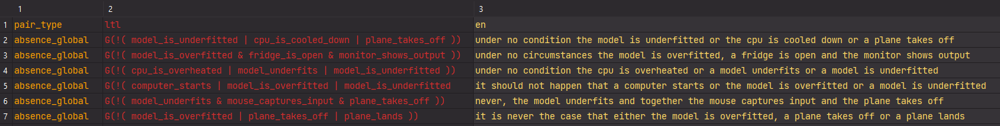
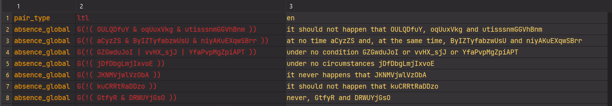

# **NL2LTL Synthetic Dataset Generator**

This project provides a generator for synthetic pairs of Linear Temporal Logic formulas and the corresponding Natural Language phrases.

These can be used to train and test Language Models or other kinds of models, in order for them to perform the translation of such sentences.

The tool is a command-line utility which has been developed and used for the paper "Neural Machine Translation: from Natural Language requirements to Linear Temporal Logic formulas” by Riccardo Coltrinari, Flavio Corradini, Marco Piangerelli and Barbara Re.

In our paper we use the datasets generated with this tool to train and test Language Models, collecting new insights on their use for translation of such sentences.

You can find our experiments here: [https://github.com/MPiangerelli/Neural-Machine-Translation](https://github.com/MPiangerelli/Neural-Machine-Translation)

While you can retrieve the datasets we created here: [https://huggingface.co/datasets/cRick/NL-to-LTL-Synthetic-Dataset](https://huggingface.co/datasets/cRick/NL-to-LTL-Synthetic-Dataset)

## **Overview**

The tool is able to generate synthetic datasets containing Natural Language requirements and their corresponding Linear Temporal Logic formulas.

In our research we divided the problem in two categories: *restricted* translation and *unrestricted* translation.
This separation is based on the form of phrases that must be translated, which drives the complexity of the problem.

Our tool is able to generate both forms of pairs, which are briefly described in the following sections.

For further information on the generation process refer to the aforementioned paper.

### **Identifiers**

In Temporal Logic, and more generally in Logic, the smallest component of a formula is the atomic proposition, sometimes called propositional variable.

An atomic proposition defines a statement that may either be true or false and cannot be divided in smaller subsets of propositions.

Atomic propositions may be expressed differently based on the language we are using (as happens here).

An example may be the statement ```"the car is blue"``` expressed in Natural Language, which may be expressed as ```"car == blue"``` in a more formal language.

In our research we call *identifiers* the atomic propositions expressed in any language, in order to simplify the notation and refer at the same time to the same element (expressed differently) in the input and the output.

### **Unrestricted Dataset**

This tool is able to generate an unrestricted dataset, which is the one containing unrestricted pairs. The following image shows an example of such dataset:



This means that each pair will contain a sentence expressed in Natural Language and the corresponding translation as a Linear Temporal Logic formula, both having unrestricted identifiers.

Unrestricted identifiers are made up of actions, such as ```"the car stops"``` or ```"the bridge is open"```. Here the input language is the whole English grammar, which makes it a much harder problem to face.

The following is an unrestricted sentence that can be generated using this tool:

```cmd
Whenever the bridge opens then the car crosses.
```

which is paired to the corresponding LTL formula:

```ltl
G (bridge_opens → car_crosses)
```

where "G" is the □ (always) LTL operator.

The goal here is to generate a phrase that is syntactically correct in all its structure, even though its meaning may not make sense.

For a deeper explanation of how identifiers work and can be represented, please refer to the [README](./resources/README.md) file in the *resources* folder.
### **Restricted Dataset**

This tool is also able to generate a restricted dataset, which is the one containing restricted pairs. The following image shows an example of such dataset:



Indeed each pair will contain a sentence expressed in Natural Language and the corresponding translation as a Linear Temporal Logic formula, both having restricted identifiers.

Restricted identifiers take the form of abbreviations of words or complex technical names, such as variable names, digital signal names, sensors identifiers, and so on.
An example may be ```"nonNullAirCondCtrl"``` or ```"isOpen"```.
Here the input language is a subset of the whole English grammar.
For this (and other) reason the translation of such phrases is easier than the unrestricted ones.

The following is an example of restricted sentence that can be found in real use cases:

```cmd
Whenever AirCondCtrl then activateFanCtrl.
```

which can be paired to the corresponding LTL formula:

```ltl
G (AirCondCtrl → activateFanCtrl)
```

where "G" is the □ (always) LTL operator.

In order to simulate such scenarios we decided to create these identifiers as random sequences of characters.

## **Installation**

First make sure to have Python 3.8 installed (it may work with other versions actually).

To use the tool simply clone this repository by downloading it or using the following command:

```cmd
git clone https://github.com/RiccardoColtrinari/nl2ltl-dataset-generator.git
```

Then move to the newly created directory:

```cmd
cd nl2ltl-dataset-generator
```

Finally, install the libraries declared in the [requirements.txt file](requirements.txt).

If you are using pip use the following command:

```cmd
pip install -r requirements.txt
```

other package managers may require a different syntax.

It is up to you whether to use a virtual environment or not (it is usually recommended).

## **Usage**

To use the tool, run main.py with the following syntax:

```cmd
main.py [OPTIONS] DATASET_TYPE
```

### **Arguments**

The tool requires one argument:

- DATASET_TYPE: The type of dataset to generate. This is a required argument and should be one of the following values: *restricted* or *unrestricted*. If the latter is passed then you also must pass the '--identifiers-file-path' option.

### **Options**

The tool supports the following optional parameters:

- '-s', '--number-of-samples': The number of samples to generate. This should be an integer value. If not provided, the default value is 10000.
- '-o', '--dataset-save-path': The file path to save the generated dataset. If not provided, the default save path is './results/dataset.csv'.
- '-i', '--identifiers-file-path': The file path to the identifiers file. This should be a txt file containing the identifiers expressed in a specific notation. This path is mandatory to generate unrestricted samples, otherwise it can be omitted.
- '-r', '--seed': The random seed to use for generating the dataset. If not provided, a random seed will be used.

## **License**

This tool is licensed under the MIT license. Please see the LICENSE file for details.

## **Support**

I am currently working to further improve documentation. However, if you have questions, comments, or you want to report a bug, please open an issue and I will address it as soon as possible.
As a further note, consider that the tool has been created with the sole purpose of meeting the requirements needed to properly run the paper's experiments.
This means that the code may sometimes appear not well engineered and not optimized, as code robustness was not the primary focus of the tool.
However, I will try to improve code's quality where necessary, in the meantime advices and modifications are welcome via pull requests.
