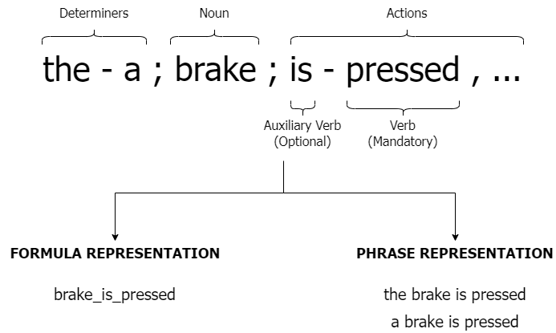

# **Overview of the Input Files**

In this directory you can find some resources to use as inputs for the generation of the dataset.

## **Experiments**

In the [experiments.txt file](./experiments.txt) you can find a brief description of the commands used to generate the datasets for the paper "Neural Machine Translation: from Natural Language requirements to Linear Temporal Logic formulas” by Riccardo Coltrinari, Flavio Corradini, Marco Piangerelli and Barbara Re.

You can use them to replicate the experiments proposed in the aforementioned paper.

## **Formula Distribution**

The current implementation generates the phrases and the formulas from fixed templates, which are then filled with the identifiers.

The templates to use were chosen among [these patterns](https://matthewbdwyer.github.io/psp/patterns/ltl.html).
In particular we performed a statistical analysis to retrieve information regarding the distribution of the patterns, in order to select the most used ones.

The [formula_distribution.json file](./formula_distribution.json) contains the result of that analysis for the selected patterns, which are the ones used as templates.
The file contains the patterns names and the corresponding number of occurrences.

At generation time, from these values we calculate the new number of samples to generate for each template, in order to obtain the given dataset dimension (10000 as default).
This is done to maintain the distribution even on a larger dataset.

The templates that are currently generated are the following ones:

| Pattern | Scope |
|---------|-------|
| Absence | Global |
| Absence | After |
| Universal | Global |
| Universal | After |
| Existence | Global |
| Existence | After |
| Response | Global |
| Response | After |

## **Identifiers**

As already mentioned, the templates are filled with identifiers both for the phrases and the formulas.

In the case of *restricted* dataset generation, the identifiers are created as sequences of random characters, hence no input is needed.

However, in case of *unrestricted* dataset generation we need to ensure syntactical coherence in the sentences.
Furthermore the latter must represent Natural Language phrases that are expressed through the common English language, which is much harder to synthesize.

For this reason the [ids2.txt](./ids2.txt) and the [ids3.txt](./ids3.txt) files declare 2 sets of identifiers that are read and merged together to create the actual identifiers that will be written within the templates.

The [ids3.txt](./ids3.txt) file was used to create the training dataset for our experiments, while the [ids2.txt](./ids2.txt) file was used to create the test one.

You can also create your own set of identifiers by following the syntax to declare them.

### **Identifiers Syntax**

The syntax to declare new identifiers is the following one:

```[determiners]; [nouns]; [actions]```

As you can see each line is composed of 3 parts: determiners, nouns and actions.

#### **Determiners**: is a set of determiners that can be used with that noun. Each determiner is separated by an hyphen character (-).

For instance ```the-a-an```.

#### **Nouns**: is a set of nouns that can perform actions, each separated by a comma character (,).

For instance ```car, truck, motorbike```.

#### **Actions**: is a set of actions that can be performed by the given nouns.

Each action is composed by an optional auxiliary verb and a mandatory verb separated by an hyphen character.
Each action is instead separated by a comma character (,).

As an example ```starts, has been-started, has-sped up```.

### **Loading Identifiers**

When the identifiers file is passed to the generator the structure of each line is read and disassembled to atomic identifiers.

This means that for each line each determiner, noun and action is combined together to form a unique identifier.

For example, if in our file we have a declaration like the following one.

```the-a; car, truck; starts, has-sped up```

then this will result in the following identifiers:

```
the car starts
the car has sped up
a car starts
a car has sped up
the truck starts
the truck has sped up
a truck starts
a truck has sped up
```

### **Identifiers Representation**

Finally, identifiers must be represented differently in the sentences than in the formulas.

As a matter of fact, identifiers have templates too.
The tool will take care of generating the correct representation.

For example, the conjunction of two identifiers like ```the car starts``` and ```the truck stops``` is represented in the phrase as follows:

```the car starts and the truck stops```

while in the formula is represented as:

```car_starts & truck_stops```

The following image summarizes all the concepts so far.



### **Differentiating the outputs**

Since Natural Language is much more complex than Temporal Logic, a formula can be expressed in many different ways in English.

For this reason this tool has multiple phrase templates associated to each type of formula.

This allows to create several representations of the same formula.

For instance the formula ```G ( car_starts )``` may be associated to the following phrases, and more:

```
It always happens that the car starts.
At any time the car starts.
The car always starts.
```

These are only some of the possibile templates available, and the same concept is also applied to the conjunction of multiple identifiers through logical operators (and, or).

For further information regarding the generation process you may refer to our paper.